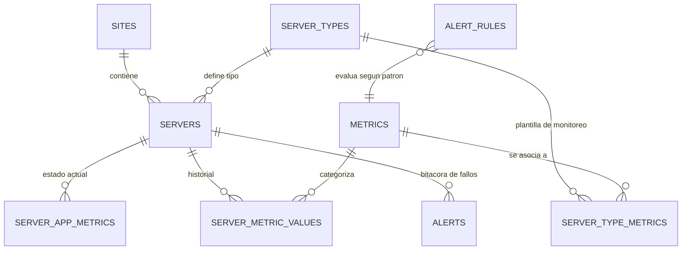

# Documentación del Modelo de Datos V3: Métricas y Alertas

Esta documentación describe la arquitectura y el flujo de datos del sistema de monitoreo V3. Está diseñada para que nuevos agentes o desarrolladores comprendan cómo se relacionan los servidores, las métricas y el sistema de alertas.

---

## 1. Entidades Principales

### `servers` (Servidores)
Es el núcleo del sistema. Cada registro representa un servidor físico o virtual que reporta datos.
- **Relación**: Es el "dueño" de las métricas y alertas.

### `metrics` (Catálogo de Métricas)
Contiene la definición de qué se puede medir (ej: `system.cpu.load`, `db.connections`).
- **Relación**: Actúa como un diccionario para normalizar los nombres de las métricas.

### `alert_rules` (Reglas de Alerta)
Define las condiciones bajo las cuales una métrica genera una alerta.
- **`metric_pattern`**: Usa patrones (ej: `system.disk.%`) para aplicar reglas a múltiples métricas.
- **`rule_type`**: `threshold` (numérico), `regex` (texto), o `freshness` (tiempo transcurrido).
- **`warning_threshold`** / **`danger_threshold`**: Valores límite.

---

## 2. El Flujo de la Métrica (Estado y Memoria)

El sistema maneja las métricas en tres niveles:

### A. Estado Actual: `server_app_metrics`
Aquí se guarda el **último valor conocido** de cada métrica para cada servidor.
- **Propósito**: Es lo que consume el Dashboard en tiempo real.
- **Campos Clave**: `metric_value` (valor bruto) y `status` (`ok`, `warning`, `danger`).
- **Actualización**: Se actualiza mediante `api/metrics.php` cada vez que llega un reporte.

### B. Histórico: `server_metric_values`
Guarda una copia de cada medición recibida a lo largo del tiempo.
- **Propósito**: Generar gráficos de tendencias (ej: uso de CPU en las últimas 24h).

### C. Configuración: `server_metrics_config`
Define qué métricas **debería** ejecutar un servidor y con qué frecuencia.
- **Relación**: Se hereda de `server_type_metrics` para automatizar la configuración según el tipo de servidor (FMS Primary, SQL Server, etc.).

---

## 3. El Sistema de Alertas (`classes/MetricsEvaluator.php`)

Las alertas no nacen de la base de datos, sino del motor de evaluación en PHP.

1. **Recepción**: `api/metrics.php` recibe un JSON con datos.
2. **Evaluación**: Se instancia `MetricsEvaluator`, que carga todas las `alert_rules`.
3. **Cruce**: El evaluador compara cada métrica recibida contra las reglas que coincidan con su `metric_pattern`.
4. **Persistencia de Alerta (`alerts`)**:
   - Si el estado es `danger` y **no existe** una alerta activa para ese servidor/métrica, se inserta una nueva fila en `alerts` con `status = 'active'`.
   - Si la métrica vuelve a `ok` o `warning`, el evaluador marca automáticamente la alerta como `solved`.

---

## 4. Diagrama de Relaciones Logicas

---

## 5. Notas para Agentes

- **Independencia**: El sistema es 100% independiente de la base de datos `checksupport`. Toda la lógica reside en `monitoring_system`.
- **Normalización**: Siempre prefiera nombres de métricas con prefijos (`system.`, `app.`, `db.`) para aprovechar el sistema de patrones de las reglas.
- **Alertas Críticas**: Las alertas en estado `danger` disparan el sistema de notificación visual en el Dashboard.
- **Soft Delete**: Los servidores no se borran físicamente, se marcan como `is_deleted = 1` en la tabla `servers`.
