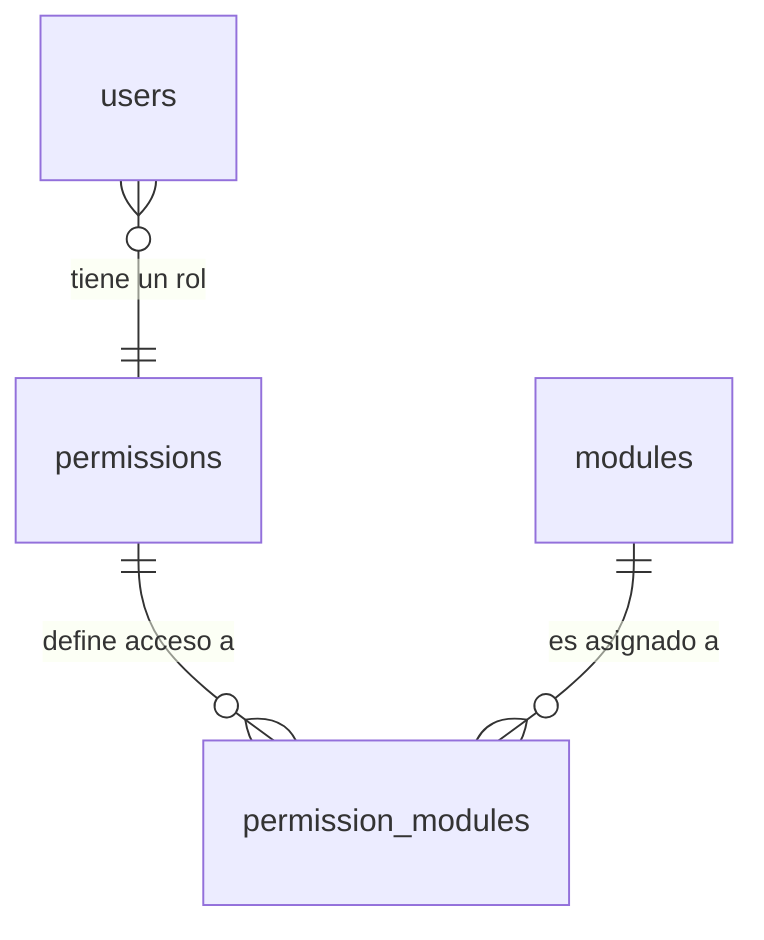

# Sistema de Permisos y Módulos (RBAC)

El sistema de Monitoreo V3 utiliza un modelo de **Control de Acceso Basado en Roles (RBAC)** para gestionar qué partes de la aplicación puede ver cada usuario.

---

## 1. Arquitectura de Tablas

El sistema se apoya en tres tablas principales que gestionan la relación entre usuarios, sus roles y las funcionalidades (módulos) disponibles.

### `permissions` (Roles)
Define los niveles de acceso o perfiles dentro del sistema.
- **Ejemplos**: `Administrador` (ID 69), `Soporte`, `amcen`.
- **Propósito**: Agrupar usuarios bajo un mismo perfil de permisos.

### `modules` (Catálogo de Funcionalidades)
Es el inventario de todas las secciones o rutas del frontend que pueden ser protegidas.
- **Campos**: `name` (Nombre visual), `path` (Ruta de React Router), `icon` (Icono de Lucide).
- **Control**: Tiene un flag `is_active` para desactivar módulos globalmente.

### `permission_modules` (Matriz de Acceso)
Es la tabla intermedia (junction table) que conecta un Rol con un Módulo.
- **`can_view`**: Booleano que determina si el rol tiene permiso para ver ese módulo específico.
- **Clave Única**: Impide duplicados para la misma combinación de Rol/Módulo.

---

## 2. Flujo de Autenticación y Carga

1.  **Login**: Al iniciar sesión (`api/login.php`), el sistema verifica el `permission_id` del usuario.
2.  **JWT**: El token generado incluye el rol del usuario para uso rápido en el frontend.
3.  **Carga de Menú**: El componente `Sidebar.tsx` llama a `api/modules.php?action=allowed`.
4.  **Backend (Single Source of Truth)**: El API cruza el `permission_id` del usuario autenticado con la tabla `permission_modules` y devuelve solo los módulos donde `can_view = 1`.

---

## 3. Consideraciones de Seguridad y Debugging

### Soporte para Proxies (Apache/PHP)
En ciertos entornos, el header `Authorization` puede ser renombrado. El sistema está preparado para buscar el token en:
1.  `HTTP_AUTHORIZATION`
2.  `REDIRECT_HTTP_AUTHORIZATION` (común en configuraciones con `.htaccess` y `mod_rewrite`).

### IDs Dinámicos en el Frontend
La gestión de usuarios ([UsersPage.tsx](file:///var/www/monitoreoLaboratorio/v3/frontend/src/pages/UsersPage.tsx)) no hardcodea los IDs de los roles. En su lugar:
1.  Consulta la lista completa de roles desde `api/permissions.php`.
2.  Permite asignar roles basados en los nombres y IDs reales de la base de datos, garantizando consistencia si se agregan nuevos perfiles.

---

## 4. Resumen de Permisos Actuales (Auditado)

| Rol | Alcance de Módulos |
| :--- | :--- |
| **Administrador** | Acceso total (7 módulos: Inicio, Clientes, Monitoreo, Usuarios, Super Admin, Tickets, Turnos). |
| **Soporte** | Operativo (5 módulos: Inicio, Clientes, Monitoreo, Tickets, Turnos). |
| **Perfiles de Faena** | Consulta (3 módulos: Inicio, Clientes, Monitoreo). |

---

## Diagrama de Relaciones

